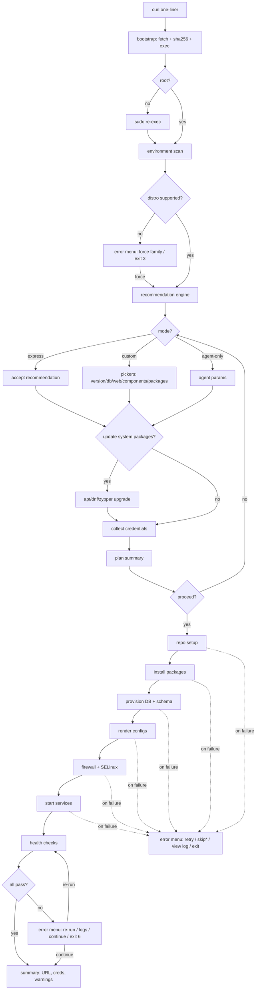

# Zabbix universal installer — build specification

**Codename:** `zbx-install`
**Deliverable:** a Bash CLI tool, hosted on GitHub, runnable via one `curl` line, that takes any supported Linux server from bare OS to a verified, running Zabbix stack — interactively or fully unattended.
**How to use this document:** implement it phase by phase (§18). Items marked *verify at build time* mean: check the current upstream docs/URLs before hardcoding, because they drift.

---

## 1. What the tool does

1. User runs `curl -fsSL https://raw.githubusercontent.com/<org>/zbx-install/main/install.sh | bash` (or downloads a release and runs it).
2. Bootstrap fetches the full installer, verifies its checksum, and re-executes it attached to the terminal.
3. Installer checks root, scans the environment, and builds a **recommended stack** (Zabbix version, DB engine, web server, components, sizing preset).
4. User picks a mode: **express** (accept recommendation), **custom** (pick everything manually, including a per-package checklist), or **agent-only**. A fourth mode, **unattended**, is triggered by `--config FILE --yes` and skips all prompts.
5. Optional: update all system packages first.
6. Installer collects the credentials it will need (hidden input, confirmation, or auto-generate).
7. Prints a plan summary; nothing executes before explicit confirmation.
8. Runs the pipeline: add Zabbix repo → install packages → provision DB + import schema → render configs → firewall/SELinux → enable & start services.
9. Runs health checks (services, ports, DB connectivity, frontend HTTP 200). On failure: log excerpt + remediation hint + retry option.
10. Prints a final summary: frontend URL, default login, credentials file path, log path, next steps.

---

## 2. Goals and non-goals

**Goals (v1):** single-node Zabbix server+frontend+agent installs, agent-only installs, express/custom/unattended modes, resumable/idempotent runs, dry-run, uninstall, container-tested across the support matrix, single-file distributable.

**Non-goals (v1):** HA clusters, upgrading existing Zabbix installs between major versions, TLS certificate automation (print guidance only), Windows agents, Docker/K8s deployment targets, remote multi-host orchestration. Proxy install is a stretch goal in Phase 7, not core.

---

## 3. Hard requirements

- Pure **Bash ≥ 4.2** at runtime. No Python/Perl/jq dependency. Allowed external commands: coreutils, `curl` (fallback `wget`), `systemctl`, the native package manager, `ss`, `awk`, `sed`, `grep`, `tput`, `openssl` (optional, with `/dev/urandom` fallback).
- Must survive `curl | bash` (see §6).
- `shellcheck`-clean with zero file-level disables, formatted with `shfmt -i 2 -ci`.
- Every interactive question has a flag or config-file equivalent, so a fully unattended run is possible.
- Requires root: if not root and `sudo` exists, re-exec via `sudo -E bash "$0" "$@"` after informing the user; if `sudo` is absent, print the error and wait for an explicit keypress before exiting 2.
- **No-exit policy (interactive mode):** the installer never terminates on its own. Every failure opens the error menu (§14) — retry, context-specific actions, view log, and an explicit Exit choice. Exit codes (Appendix B) are returned only when the user picks Exit; unattended mode fails fast with the same codes.
- Idempotent: a re-run detects completed steps via the state file (§14) and offers resume/repair instead of blindly redoing everything.
- No secrets in argv, exported environment, or logs (§10).
- Respects `NO_COLOR` and `--no-color`. English UI only.

---

## 4. Support matrix (v1)

| Family | `/etc/os-release` IDs | Versions | Pkg mgr | Notes |
|---|---|---|---|---|
| Debian | `debian` | 12, 13 | apt | |
| Ubuntu | `ubuntu` | 22.04, 24.04 | apt | ufw usually inactive by default — see §15 |
| RHEL-like | `rhel`, `centos` (Stream 9), `rocky`, `almalinux`, `ol` | 8, 9 | dnf | EL8 needs a PHP module switch — see §15 |
| SUSE | `sles`, `opensuse-leap` | SLES 15 SP5+, Leap 15.6 | zypper | SLES frontend needs Web & Scripting module — see §15 |
| Stretch (feature-flag, Phase 7+) | `amzn` (2023), Raspberry Pi OS 12 | — | dnf / apt | only if Zabbix publishes packages; *verify at build time* |

Match on `ID` first, fall back to `ID_LIKE`. Architecture: `x86_64` fully supported; `aarch64` only where Zabbix publishes packages for that distro (*verify at build time*), otherwise print a clear unsupported message.

**Zabbix versions offered:** `7.0` LTS (**default recommendation**) and `7.4` (current stable; 7.4.11 as of June 2026). Keep `SUPPORTED_ZBX_VERSIONS=("7.0" "7.4")` in exactly one place in `detect.sh` so adding `8.0` LTS when it ships is a one-line change. Do not offer 6.0.

**DB engines:** MariaDB (default), MySQL 8.x, PostgreSQL 15/16 with optional TimescaleDB. Embed a per-Zabbix-version minimum-version map (`REQ_MYSQL`, `REQ_MARIADB`, `REQ_PGSQL`) and validate the detected/installed engine against it; populate the map from https://www.zabbix.com/documentation/7.0/en/manual/installation/requirements and the 7.4 equivalent (*verify at build time*).

**Web server:** Apache (default), Nginx + php-fpm.
**Agent:** `zabbix-agent2` (default), classic `zabbix-agent` selectable.

---

## 5. Repository layout and bundling

```
zbx-install/
├── install.sh              # tiny bootstrap (<100 lines), safe to pipe
├── src/
│   ├── main.sh             # arg parsing, mode dispatch, top-level flow
│   └── lib/
│       ├── core.sh         # strict mode, logging, run() wrapper, traps, state file
│       ├── ui.sh           # ask_yn / ask_choice / ask_multi / ask_secret / spinner
│       ├── detect.sh       # environment scan → DETECT_* variables
│       ├── recommend.sh    # detection → recommended stack
│       ├── creds.sh        # credential collection, generation, redaction
│       ├── configfile.sh   # --config FILE parser (Appendix A)
│       ├── repo.sh         # zabbix-release URL builder + repo setup
│       ├── pkg.sh          # apt/dnf/zypper abstraction (update, install, remove)
│       ├── db_mysql.sh     # MariaDB/MySQL provisioning + schema import
│       ├── db_pgsql.sh     # PostgreSQL (+TimescaleDB) provisioning + import
│       ├── config.sh       # render zabbix_server.conf, PHP tz, web vhost, zabbix.conf.php
│       ├── firewall.sh     # firewalld/ufw + SELinux handling
│       ├── services.sh     # enable/start/restart with per-distro service names
│       ├── health.sh       # post-install checks + remediation hints
│       └── adminpass.sh    # optional post-install frontend Admin password change (§15.8)
├── build.sh                # bundles src/ → dist/zbx-install.sh (single file)
├── Makefile                # lint / fmt / test / matrix / build
├── tests/
│   └── bats/               # unit tests (detect, recommend, creds, url builder)
├── .github/workflows/
│   ├── ci.yml              # shellcheck + shfmt + bats + container smoke matrix
│   └── release.yml         # on tag: build dist, SHA256SUMS, GitHub Release
└── README.md               # one-liner, flags, support matrix, screenshots
```

**Bundling rule:** each lib sources nothing at runtime when bundled. In `src/`, `main.sh` sources libs with lines tagged `# @dev-source`; `build.sh` concatenates files in a fixed order (core → ui → detect → recommend → creds → configfile → repo → pkg → db_* → config → firewall → services → health → adminpass → main), strips the `# @dev-source` lines, prepends a header with version + build date, and writes `dist/zbx-install.sh`. Run shellcheck against both `src/` and the bundle. Releases publish `dist/zbx-install.sh` + `SHA256SUMS`.

---

## 6. Bootstrap and the `curl | bash` problem

Piping a script into bash consumes stdin, which breaks every `read` prompt. `install.sh` must handle this explicitly:

1. If `[ ! -t 0 ]` and `/dev/tty` is readable → `exec </dev/tty` to reattach the keyboard.
2. If there is genuinely no TTY (headless CI, cloud-init): interactive mode is impossible — require `--config FILE --yes` or `--express --yes`, otherwise exit 2 with a one-line explanation of exactly that (the single case where prompting is physically impossible, so the no-exit policy cannot apply).
3. Channel selection: default = latest GitHub Release asset (`dist/zbx-install.sh` + `SHA256SUMS`, checksum verified with `sha256sum -c`); `--dev` = raw `main` branch (no checksum, print a warning).
4. Download to `mktemp -d`, then `exec bash "$tmp/zbx-install.sh" "$@"` so all original flags pass through.

The bootstrap itself must be trivial enough to audit at a glance: no logic beyond the above.

---

## 7. CLI interface

```
zbx-install.sh [MODE] [OPTIONS]

Modes (mutually exclusive; default: interactive menu)
  --express               accept the recommended stack, minimal prompts
  --agent-only            install and configure only the agent
  --config FILE           unattended: read answers from FILE (see Appendix A)
  --detect-only           print the environment report and exit
  --uninstall             remove Zabbix (asks about data/config retention)

Options
  --yes                   assume yes on confirmations (required for headless)
  --dry-run               print every command instead of executing
  --zabbix-version X.Y    override suggested Zabbix version
  --db mysql|pgsql        override DB engine (mysql covers MariaDB)
  --web apache|nginx      override web server
  --components LIST       comma list: server,frontend,agent (agent2 implied)
  --update / --no-update  force/skip the system-update step
  --generate-passwords    auto-generate all secrets without prompting
  --admin-pass            also change the frontend Admin password (§15.8)
  --creds-file PATH       where to write the credentials summary (default:
                          /root/zbx-install-credentials.txt; use "none" to skip)
  --log-file PATH         default /var/log/zbx-install-<timestamp>.log
  --no-color              disable ANSI colors (also honors NO_COLOR)
  -h|--help, -V|--version
```

**Exit codes:** `0` success · `1` unexpected error · `2` usage / no TTY without unattended flags · `3` unsupported OS or arch · `4` no network to repo.zabbix.com · `5` not root and no sudo · `6` user aborted at confirmation · `7` install step failed · `8` health checks failed after retry.

---

## 8. Detection spec (`detect.sh`)

Produce a set of `DETECT_*` readonly variables plus a pretty table for `--detect-only`. Sources of truth:

| Item | How |
|---|---|
| OS family/version | parse `${OS_RELEASE_FILE:-/etc/os-release}` — the override variable exists purely so bats tests can inject fixtures |
| Package manager | first of `apt-get`, `dnf`, `zypper` found via `command -v`; must agree with family |
| Arch | `uname -m` |
| RAM / CPU | `/proc/meminfo` MemTotal; `nproc` |
| Disk | `df -Pk /var` and `/` (Zabbix DB lives under /var); warn < 10 GiB free |
| Network | `curl -sI --max-time 8 https://repo.zabbix.com/` — failure ⇒ error menu: retry · continue with `--dry-run` · exit 4 (unattended: exit 4 immediately) |
| Existing Zabbix | package query + `systemctl list-unit-files 'zabbix*'` — if found, offer repair/uninstall/exit; never upgrade in v1 |
| Existing DB / web | `command -v mysql/mariadb/psql`, unit files for mariadb/mysqld/mysql/postgresql*/httpd/apache2/nginx |
| SELinux | `getenforce` if present |
| Firewall | active unit among firewalld / ufw / none |
| Port conflicts | `ss -ltnH` on 80, 443, 10050, 10051 (and 5432/3306 if that engine is being newly installed) |
| Virtualization | `systemd-detect-virt`; if container, warn that systemd services may not work |

---

## 9. Recommendation engine (`recommend.sh`)

Deterministic rules, applied to detection output — no magic:

1. **Zabbix version:** latest entry of `SUPPORTED_ZBX_VERSIONS` marked LTS → default `7.0`; offer `7.4` as "current stable".
2. **DB engine:** if PostgreSQL already installed and healthy → suggest `pgsql`; else if MySQL/MariaDB already installed → suggest `mysql`; else default **MariaDB**.
3. **Web server:** if nginx present and apache absent → nginx; else Apache.
4. **Components:** full stack (server+frontend+agent2) unless RAM < 2 GiB → warn and suggest agent-only.
5. **Sizing preset** from RAM: `<2` GiB = warn; `2–4` = small; `4–8` = medium; `>8` = large. Presets set `innodb_buffer_pool_size` / `shared_buffers` plus `CacheSize`/`ValueCacheSize` in `zabbix_server.conf` (encode the actual numbers as a table in `recommend.sh` with a comment justifying each).
6. **Timezone:** `timedatectl show -p Timezone --value`, fallback prompt, final fallback `UTC`.

Express mode = this output verbatim. Custom mode = this output as pre-selected defaults in every picker.

---

## 10. Credentials handling — strict rules

Secrets involved: DB admin password (only when an existing MySQL root password is required), `zabbix` DB user password, and (Phase 7 option) a new frontend Admin password.

- Collect with `ask_secret` (uses `read -rs`, double entry, minimum 12 chars, must not contain the username). Offer `g` at the prompt to auto-generate: `openssl rand -base64 24 | tr -d '/+=' | cut -c1-20`, fallback `tr -dc 'A-Za-z0-9' </dev/urandom | head -c 20`.
- **Never** pass secrets as command arguments (`mysql -p"$PASS"` is forbidden — visible in `ps`) and never `export` them.
- MySQL/MariaDB: write a `mktemp` defaults file (`[client]\nuser=root\npassword=...`), `chmod 600`, use `mysql --defaults-extra-file=...`, delete via the EXIT trap. Fresh MariaDB installs use `unix_socket` auth for root, so no admin password is needed at all — prefer that path.
- PostgreSQL: operate through `sudo -u postgres psql` (peer auth). Set the zabbix role password by feeding `ALTER USER zabbix PASSWORD '...';` via stdin heredoc, never via `psql -c` argv.
- `zabbix_server.conf` containing `DBPassword` must end up `root:zabbix 0640` (that is the package default — enforce it after editing).
- Logging: `log()` pipes every line through a `redact()` function that replaces the values of all collected secrets with `********` before writing. `--dry-run` output is redacted the same way. Never run `set -x` in code paths that touch secrets.
- Credentials summary file (opt-in prompt, default path `/root/zbx-install-credentials.txt`): `umask 077`, `chmod 600`, header warning to delete after storing in a vault.

---

## 11. System update step

Asked once (`Update all system packages before installing? [y/N]`), controlled by `--update/--no-update/UPDATE_SYSTEM=`. Commands:

| Family | Command |
|---|---|
| apt | `apt-get update && apt-get -y upgrade` (not dist-upgrade — no removals) |
| dnf | `dnf -y upgrade` |
| zypper | `zypper --non-interactive update` |

Afterwards detect reboot-needed (`/var/run/reboot-required`, `needs-restarting -r`, `zypper ps -s`) and warn only — never reboot automatically. Record package counts before/after in the log.

---

## 12. Install pipeline — per-family detail

Every step below runs through `run()` (dry-run aware), logs before/after, and updates the state file so a failed run can resume.

### 12.1 Zabbix repo setup (`repo.sh`)

Build the release-package URL from `$DETECT_OS_ID`, `$DETECT_OS_VERSION`, `$ZBX_VERSION` in one function `zbx_release_url()`. Known patterns (**verify each at build time against repo.zabbix.com — do not trust these blindly, Zabbix occasionally changes naming**):

| Family | URL pattern |
|---|---|
| Ubuntu | `https://repo.zabbix.com/zabbix/${ZBX_VERSION}/release/ubuntu/pool/main/z/zabbix-release/zabbix-release_latest_${ZBX_VERSION}+ubuntu${OS_VERSION}_all.deb` |
| Debian | same but `.../release/debian/...` and `+debian${OS_MAJOR}` |
| RHEL-like | `https://repo.zabbix.com/zabbix/${ZBX_VERSION}/release/rhel/${OS_MAJOR}/noarch/zabbix-release-latest-${ZBX_VERSION}.el${OS_MAJOR}.noarch.rpm` |
| SLES/Leap | `https://repo.zabbix.com/zabbix/${ZBX_VERSION}/release/sles/15/noarch/zabbix-release-latest-${ZBX_VERSION}.sl15.noarch.rpm` |

Install: apt → `curl -fsSLo /tmp/zbx-release.deb "$url" && dpkg -i /tmp/zbx-release.deb && apt-get update`; dnf → `rpm -Uvh --force "$url" && dnf clean all && dnf makecache`; zypper → `rpm -Uvh --force "$url" && zypper --gpg-auto-import-keys refresh`. On EL8 additionally run the PHP module dance (§15). Verify the repo actually resolves (one `apt-cache policy zabbix-server-mysql` / `dnf info` / `zypper info` probe) before continuing — on failure open the error menu showing the exact URL tried: retry · pick a different Zabbix version · exit 5 (unattended: exit 5).

### 12.2 Package install (`pkg.sh`)

Component → package name mapping (identical names across families, only the meta packages differ):

| Component | Packages |
|---|---|
| server (mysql) | `zabbix-server-mysql zabbix-sql-scripts` |
| server (pgsql) | `zabbix-server-pgsql zabbix-sql-scripts` |
| frontend | `zabbix-frontend-php` + `zabbix-apache-conf` **or** `zabbix-nginx-conf` |
| agent | `zabbix-agent2` (default) or `zabbix-agent`; agent2 plugins offered in custom mode: `zabbix-agent2-plugin-postgresql`, `-mongodb`, `-mssql` |
| tools (custom mode optional) | `zabbix-get zabbix-sender` |
| SELinux (RHEL only, auto) | `zabbix-selinux-policy` |
| proxy (Phase 7 stretch) | `zabbix-proxy-mysql` or `zabbix-proxy-sqlite3` |

Plus the DB engine itself when not already installed (`mariadb-server` / `mysql-server` / `postgresql` + `postgresql-server` on RHEL) and the web server if missing. Install in **one** package-manager transaction per group; on failure print the manager's own error verbatim and open the error menu: retry · view log · exit 5.

### 12.3 Database provisioning (`db_mysql.sh` / `db_pgsql.sh`)

MySQL/MariaDB:
1. Detect the actual unit name (`mariadb` → `mysqld` → `mysql`, first that exists), enable + start it.
2. Fresh MariaDB → root over `unix_socket`, no password needed. Existing install with a root password → prompt once, use defaults-file (§10).
3. `CREATE DATABASE IF NOT EXISTS zabbix CHARACTER SET utf8mb4 COLLATE utf8mb4_bin;` create user `zabbix@localhost`, grant all on `zabbix.*`.
4. Import guard: skip if `SELECT COUNT(*) FROM users` already works (resume case). Otherwise `SET GLOBAL log_bin_trust_function_creators = 1;` → `zcat /usr/share/zabbix-sql-scripts/mysql/server.sql.gz | mysql --defaults-extra-file=... zabbix` → set it back to `0`.

PostgreSQL:
1. RHEL-like: `postgresql-setup --initdb` if data dir empty; enable + start.
2. `sudo -u postgres createuser zabbix` (password via `ALTER USER` stdin heredoc, §10), `sudo -u postgres createdb -O zabbix zabbix`.
3. Import: `zcat /usr/share/zabbix-sql-scripts/postgresql/server.sql.gz | sudo -u zabbix psql zabbix` (add a pg_hba local md5/scram line for the zabbix role first if peer auth for it fails, then reload).
4. TimescaleDB (optional toggle, custom mode only): only proceed if a repo-available timescaledb version matches the installed PG major; run `timescaledb.sql` after schema; print the license note (TSL vs Apache features) and Zabbix docs link. If versions don't line up, print a warning and continue without it.

### 12.4 Config rendering (`config.sh`)

One idempotent helper: `set_conf FILE KEY VALUE` — replaces an existing `^KEY=` or `^# KEY=` line, appends if absent (sed, no duplicate lines on re-run). Apply:

- `/etc/zabbix/zabbix_server.conf`: `DBName`, `DBUser`, `DBPassword`, sizing preset values (§9), then enforce `root:zabbix 0640`.
- PHP timezone: set `php_value[date.timezone]` in `/etc/php-fpm.d/zabbix.conf` (RHEL) or `date.timezone` in `/etc/zabbix/php-fpm.conf` / apache conf — whichever of the known paths exists on this family; log which one was touched.
- nginx only: uncomment `listen` / `server_name` in `/etc/zabbix/nginx.conf`.
- **Frontend wizard skip:** render `/etc/zabbix/web/zabbix.conf.php` directly from a heredoc template (DB type/host/name/user/password, `$ZBX_SERVER_NAME`), `chown` to the web user (`apache`/`www-data`/`wwwrun`), `chmod 600`. First browser visit then lands on the login page, not setup.
- Agent: `Server=` / `ServerActive=` = server IP (local install → `127.0.0.1`), `Hostname` = `$(hostname -f)`.

### 12.5 Firewall + SELinux (`firewall.sh`)

Asked as one plan item (`OPEN_FIREWALL`, default yes when a firewall is active):

| Detected | Commands |
|---|---|
| firewalld | `firewall-cmd --permanent --add-port={10050,10051}/tcp --add-service={http,https}` then `--reload` |
| ufw active | `ufw allow 10050,10051/tcp` + `ufw allow 'Nginx Full'`/`'Apache Full'` or `80,443/tcp` |
| none | print the ports and a note; do nothing |

SELinux enforcing (RHEL): ensure `zabbix-selinux-policy` installed, `setsebool -P httpd_can_connect_zabbix on zabbix_can_network on`. Never suggest disabling SELinux.

### 12.6 Service start (`services.sh`)

`systemctl enable --now` in order: DB → `zabbix-server` → web (`httpd`/`apache2`/`nginx` + `php-fpm` where used) → `zabbix-agent2`. After each, poll `systemctl is-active` up to 15 s; on failure dump `journalctl -u UNIT -n 30 --no-pager` into the log and continue to health checks (which will fail loudly with context).

---

## 13. Health checks & summary (`health.sh`)

| # | Check | Command | Hint on failure |
|---|---|---|---|
| 1 | server service | `systemctl is-active zabbix-server` | `journalctl -u zabbix-server -n 50` |
| 2 | agent service | `systemctl is-active zabbix-agent2` | same pattern |
| 3 | web service | `is-active` httpd/apache2/nginx (+php-fpm) | config test: `apachectl configtest` / `nginx -t` |
| 4 | server port | `ss -ltn 'sport = :10051'` non-empty | check `DBPassword`, server log `/var/log/zabbix/zabbix_server.log` |
| 5 | agent port | `ss -ltn 'sport = :10050'` | agent log |
| 6 | DB reachable | one `SELECT 1` as zabbix user | grants / pg_hba |
| 7 | schema present | `SELECT COUNT(*) FROM users` ≥ 1 | re-run import (state file marks it) |
| 8 | frontend HTTP | `curl -fsS -o /dev/null -w '%{http_code}' http://127.0.0.1/zabbix/` (accept 200/302) | web conf, SELinux booleans, php-fpm |
| 9 | agent answers | `zabbix_get -s 127.0.0.1 -k agent.ping` = 1 (if zabbix-get installed) | agent `Server=` line |

All pass → green summary block: frontend URL(s) built from detected IPs, **default login `Admin` / `zabbix` + bold "change it now" warning** (or, if `--admin-pass`/`ADMIN_PASS` was given, confirmation that it was already changed — see §15.8), config file paths, log paths, DB name/user, creds-file path if written, and an uninstall one-liner. Any fail → red block listing failed checks with hints and the log path, then the error menu: re-run checks · view logs · continue to summary anyway (marked degraded) · exit 6. Unattended: exit 6.

If `--admin-pass`/`ADMIN_PASS` was given, the frontend Admin password is changed via the API (`adminpass.sh`, §15.8) after these 9 checks pass but before the summary prints — its own retry/skip/log error menu (no "back to plan", same reasoning as health) never blocks an otherwise-successful install.

---

## 14. Error handling, state & uninstall (`core.sh`)

Skeleton requirements:

- `set -Eeuo pipefail`; `IFS=$'\n\t'`.
- `run()` — logs the command (redacted), executes unless `DRY_RUN=1`, captures rc.
- **`err_menu STEP_ID REASON` — the heart of the no-exit policy.** Interactive mode never exits by itself; every failure lands here:

  ```
  ✗ <step> failed — <reason>
  <last 5 redacted log lines>
  [r] Retry step   [l] View log (last 50)   [s] Skip step*   [b] Back to plan   [x] Exit
  ```

  Options are context-aware — drive them from a per-step table in `core.sh`:

  | Failure context | Menu options (Exit always last) |
  |---|---|
  | unsupported OS/arch (§4, §8) | show detection report · force closest family (best effort, logged) · exit 3 |
  | network unreachable (§8) | retry · continue with `--dry-run` · exit 4 |
  | repo probe (§12.1) | retry · pick different Zabbix version · exit 5 |
  | package transaction (§12.2) | retry · view log · exit 5 |
  | DB provisioning (§12.3) | retry · re-enter credentials · exit 8 |
  | config / firewall / services (§12.4–12.6) | retry · skip step (warn, mark degraded) · view log · exit 5 |
  | health checks (§13) | re-run checks · view logs · continue to summary anyway (degraded) · exit 6 |

  `skip` is offered only where the pipeline can meaningfully continue (firewall: yes; repo/packages/DB: never). Skipped steps are recorded and listed in the summary as degraded. Per-step retry counter: from the third retry, add a hint pointing at the log and the matching §15 gotcha — but keep offering the same options, never auto-exit.
- Exiting is always explicit: `[x]` (and Ctrl-C via a SIGINT trap) asks `Exit installer? [y/N]`, prints the resume note if mid-pipeline, then exits with that step’s Appendix B code — wrappers around interactive runs still get meaningful codes.
- `die MSG CODE` — red message + log path + exit; **unattended mode only** (`--config`/`--yes`/no TTY, where menus are impossible).
- `trap on_err ERR` printing `${BASH_SOURCE[1]}:${BASH_LINENO[0]}: command failed` plus the last log lines, then routing to `err_menu` (interactive) or `die` (unattended).
- `trap on_exit EXIT` — delete temp defaults-files, restore `log_bin_trust_function_creators` if we set it, remove partial downloads.
- State file `/var/lib/zbx-install/state` (`KEY=done` lines per pipeline step). On start, if state exists and is incomplete → offer resume (skip done steps) or fresh. `--resume` flag skips the question.
- `--uninstall`: remove zabbix packages + repo file only; ask separately whether to drop the `zabbix` DB/user and whether to delete `/etc/zabbix`. **Never** remove the DB engine or web server. Print what was kept.

---

## 15. Known gotchas (encode as comments in the relevant module)

1. `curl | bash` eats stdin → bootstrap must `exec </dev/tty` (§6).
2. **EL8 only:** `dnf module reset php -y && dnf module enable php:8.0 -y` (or the stream the chosen Zabbix version's frontend requires — verify against Zabbix docs for the pinned version) before installing the frontend; EL9 needs nothing.
3. MySQL schema import fails on binlog + stored functions → `log_bin_trust_function_creators` toggle (§12.3).
4. RHEL PostgreSQL ships uninitialized → `postgresql-setup --initdb` guard (§12.3).
5. SLES: frontend needs PHP from the **Web and Scripting Module**; some deps live in **PackageHub** — activate via `SUSEConnect -p` / `zypper ar` before frontend install on SLES proper (Leap unaffected). Detect and print the exact activation command instead of failing cryptically.
6. Ubuntu ufw is installed but inactive by default → treat "inactive" as "none" but mention it in the plan.
7. MariaDB unit name varies (`mariadb`/`mysqld`/`mysql`) → detect, don't hardcode (§12.3).
8. Frontend default login is `Admin`/`zabbix` → always warn; opt-in `--admin-pass` (or `ADMIN_PASS` in a `--config` file) changes it via the API (`user.login` then `user.update` with `current_passwd` set to the known default) after health checks confirm the frontend is reachable. Auth token goes in an `Authorization: Bearer` header, never the deprecated `auth` body param (current API, 7.0/7.4). `passwd` (not `password`) is the API's field name for the new value. Gated on **both** `frontend` and `server` being in this plan's components, not frontend alone — the known Admin/zabbix default only applies to a schema this install itself just imported, not to a frontend pointed at a remote/pre-existing database.
9. TimescaleDB ↔ PostgreSQL major-version matching (§12.3.4).
10. arm64: Zabbix repos cover most but not all family/version combos → if `DETECT_ARCH=aarch64` and the repo probe (§12.1) fails, say so explicitly in the error menu ("no repo for this arch/OS combo": agent-only fallback if the agent repo resolves · exit 3).
11. Frontend setup wizard is skipped only if `zabbix.conf.php` is valid and readable by the web user — get ownership/mode right (§12.4).
12. Containers without systemd: `systemctl` calls fail → detection warns at §8; document that full-stack install requires systemd (CI uses a systemd-enabled image for E2E).

---

## 16. Testing & CI

`Makefile` targets: `lint` (shellcheck on src/ + built artifact), `fmt` (shfmt -d), `test` (bats), `build`, `matrix` (container smoke), `clean`.

- **bats unit tests** for pure logic: URL builder, recommendation table, `set_conf` idempotency, redaction, config-file parser. Detection tested via `OS_RELEASE_FILE=tests/fixtures/os-release.ubuntu2404` etc. — one fixture per supported family/version.
- **Container smoke matrix** (fast, no systemd needed): run built script with `--detect-only`, then `--dry-run --express --yes`, assert exit 0 and sane plan output, on images: `ubuntu:22.04`, `ubuntu:24.04`, `debian:12`, `debian:13`, `rockylinux:9`, `almalinux:8`, `opensuse/leap:15.6`.
- **Full E2E** (CI, slower): real install on the GitHub Actions Ubuntu runner (`--express --yes --no-update`), assert all health checks pass; plus one EL9 run in a `--privileged` systemd-init container.
- `ci.yml`: lint + unit + smoke matrix on every push/PR. `release.yml`: on tag `v*` → build, generate `SHA256SUMS`, create GitHub Release with `install.sh`, `dist/zbx-install.sh`, `SHA256SUMS`.

---

## 17. Coding standards

Strict mode everywhere; `readonly` for constants; `local` in every function; no `eval`; quote every expansion; arrays for lists. Module namespace prefixes (`detect_`, `db_mysql_`, `ui_`…). Functions ≤ ~50 lines — split otherwise. ShellCheck clean with **no blanket disables**; a line-level `# shellcheck disable=SCxxxx` needs a justification comment. Every module starts with a header comment stating its contract (inputs → outputs/side effects).

---

## 18. Implementation phases (build in this order, don't skip)

| Phase | Scope | Acceptance |
|---|---|---|
| 0 | Repo scaffold, `core.sh` (incl. `err_menu`), `ui.sh`, logging/redaction, `build.sh`, Makefile, CI lint+unit green | `make lint test` passes; built artifact runs `--help` |
| 1 | `detect.sh` + `--detect-only` | Correct output on all 7 smoke images via fixtures + containers |
| 2 | `recommend.sh`, mode select, pickers, plan summary, confirm | `--dry-run --express --yes` produces a full sane plan end-to-end on all images |
| 3 | `repo.sh` + `pkg.sh` | Real package install succeeds on Ubuntu 24.04 + Rocky 9 |
| 4 | `creds.sh` + both DB modules | Schema imported; secrets never in ps/logs (grep the log in the test) |
| 5 | `config.sh`, `firewall.sh`, `services.sh` | Frontend reachable without setup wizard on E2E |
| 6 | `health.sh` + summary | All 9 checks green on E2E; failure path renders the error menu with hints |
| 7 | Unattended (`--config`), `--agent-only`, `--uninstall`, resume, `--admin-pass` (stretch: proxy) | Config-file install with zero prompts; uninstall leaves DB engine |
| 8 | Bootstrap polish, README (curl one-liner front and center), release workflow, tag `v0.1.0` | Fresh VM: one-liner → working Zabbix |

---


## Appendix A — config file keys (`--config`)

`MODE` (express|custom|agent-only) · `ZBX_VERSION` (7.0|7.4) · `COMPONENTS` (comma list: server,frontend,agent) · `DB_ENGINE` (mariadb|mysql|pgsql) · `DB_PASS` · `DB_ADMIN_PASS` (only for pre-existing MySQL root) · `WEB_SERVER` (apache|nginx) · `PHP_TZ` · `UPDATE_SYSTEM` (yes|no) · `OPEN_FIREWALL` (yes|no) · `GENERATE_PASSWORDS` (yes|no — autogen anything unset) · `CREDS_FILE` (path|none) · `AGENT_TYPE` (agent2|agent) · `ZBX_SERVER_IP` (agent-only mode) · `TIMESCALEDB` (yes|no) · `ASSUME_YES` (yes|no) · `ADMIN_PASS` (a literal password, or `generate` to auto-generate — opts into §15 gotcha 8, frontend-only)

Parser rules: `KEY=VALUE` lines, `#` comments, unknown keys → hard error (catches typos), file must be `0600` or a warning is printed. Secrets in the file are honored but the summary reminds the user to delete it.

## Appendix B — exit codes

`0` success · `2` usage/TTY error · `3` unsupported OS/arch · `4` network failure · `5` package/repo failure · `6` health checks failed · `7` user abort · `8` DB provisioning failure

Interactive mode returns these only after the user picks Exit in an error menu (or confirms Ctrl-C); unattended mode returns them immediately on failure.

## Appendix C — flowchart (mermaid, mirrors the three panels above)


